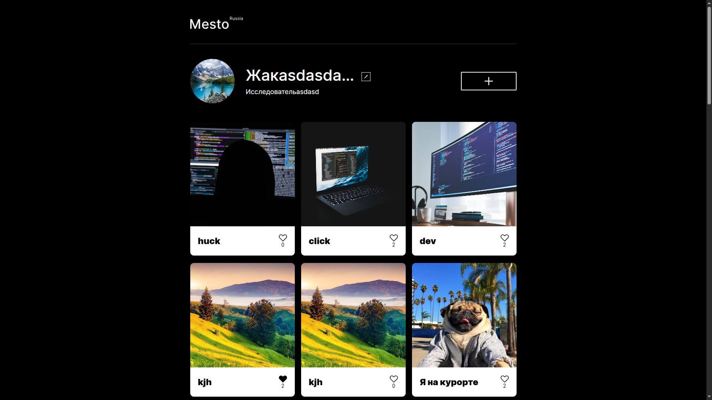

# Проект "Место" – Адаптивная социальная сеть для путешественников

## О проекте

Проект представляет собой одностраничное приложение социальной сети, посвящённой путешествиям по России. На платформе пользователи могут делиться фото и отзывами о различных местах. Сайт имеет адаптивную вёрстку и оптимизирован для всех типов устройств. Реализованы попапы для редактирования профиля, загрузки публикаций и изменения аватара.

Проект выполнен в рамках курса **"Веб-разработчик +"**, 16-я когорта.

## Превью проекта



## Ссылка на демо

- [Посмотреть сайт](https://mesto-project-inky.vercel.app/)

## Статус проекта

Проект завершён.

## Функциональность

- **Адаптивная вёрстка**: Корректное отображение на экранах от 340px до 1280px и выше.
- **Семантическая разметка**: Используются теги `<header>`, `<main>`, `<section>`, `<footer>`, а также элементы формы для взаимодействия с пользователем.
- **Pop-up окна**: Реализованы для редактирования профиля, добавления новых публикаций, а также для просмотра и удаления изображений.
- **БЭМ-структура**: Именование классов по методологии БЭМ для лучшей читаемости и поддержки.
- **Форма валидации**: Для полей ввода используется валидация, чтобы обеспечить корректные данные.
- **Оптимизация изображений**: Изображения в проекте сжаты и оптимизированы для быстрого загрузки.

## Технологии и инструменты

- **HTML5** — Семантическая и структурированная разметка.
- **CSS3** — Адаптивные стили, Flexbox и Grid для позиционирования.
- **JavaScript** — Логика взаимодействия с пользователем, обработка форм и попапов.
- **Регулярные выражения** — Для валидации данных в формах.
- **Webpack** — Сборка проекта для эффективной работы и минимизации файлов.
- **Методология БЭМ** — Чистота и масштабируемость кода.
- **Оптимизация изображений** — Сжатие и поддержка различных разрешений экранов.

## Как запустить проект локально

1. Клонируйте репозиторий:

   ```bash
   git clone https://github.com/kirill-io/mesto-project.git
   ```

2. Перейдите в папку проекта:

  ```bash
   cd mesto
   ```

3. Установите зависимости:

  ```bash
   npm install
   ```

4. Запустите проект в режиме разработки:

  ```bash
   npm run dev
   ```

5. Для сборки проекта используйте:

  ```bash
   npm run build
   ```
